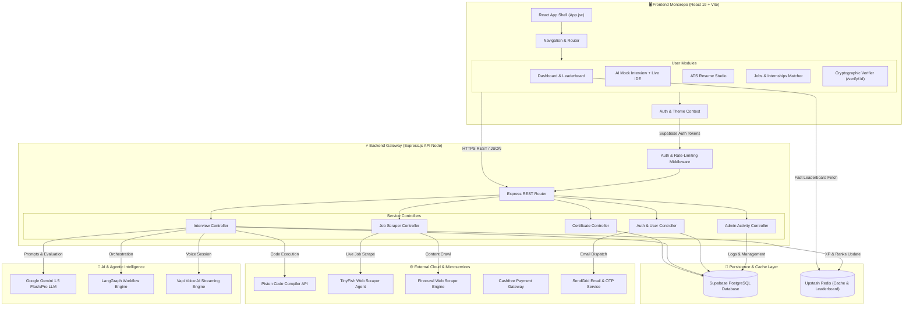
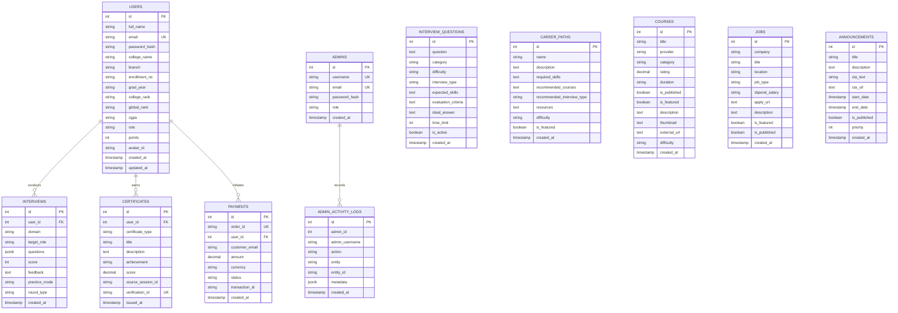
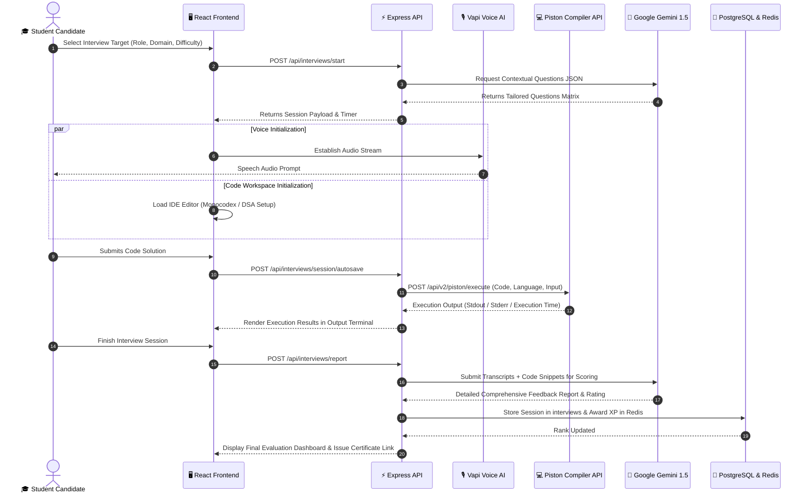

<div align="center">

# 🚀 Interact.ai 2.0
### Enterprise-Grade Campus-to-Corporate AI Acceleration Platform

[](https://react.dev/)
[](https://vitejs.dev/)
[](https://nodejs.org/)
[](https://expressjs.com/)
[](https://supabase.com/)
[](https://deepmind.google/technologies/gemini/)
[](https://upstash.com/)
[](LICENSE)

<p align="center">
  <b>Interact.ai</b> is an end-to-end, AI-driven career acceleration ecosystem bridging academia and industry. Built with high-concurrency micro-services, real-time voice AI streaming, live code compilation, automated ATS resume scoring, intelligent job aggregation, and gamified peer leaderboards.
</p>

[Explore System Architecture](#-system-architecture) • [ER Diagram](#-database-entity-relationship-er-model) • [Setup Guide](#-getting-started--installation) • [API Specs](#-api-endpoints-reference)

---

</div>

## 📌 Table of Contents
- [Executive Overview](#-executive-overview)
- [System Architecture](#-system-architecture)
- [Database Entity-Relationship (ER) Model](#-database-entity-relationship-er-model)
- [User Journey & Sequence Workflows](#-user-journey--sequence-workflows)
- [Key Features & Capabilities](#-key-features--capabilities)
- [Technology Stack Matrix](#-technology-stack-matrix)
- [Project Directory Structure](#-project-directory-structure)
- [Environment Configuration](#-environment-configuration)
- [Getting Started & Installation](#-getting-started--installation)
- [API Endpoints Reference](#-api-endpoints-reference)
- [License & Contributing](#-license--contributing)

---

## 🌟 Executive Overview

**Interact.ai 2.0** transforms how candidates prepare for tech careers and how institutions track skill readiness. By unifying real-time interactive AI mock interviews, custom code execution, web intelligence job aggregation, and cryptographic skill verifications into a sleek monorepo application, Interact.ai offers a frictionless experience for both students and enterprise administrators.

### Core Value Propositions:
- 🎙️ **Real-Time AI Voice & Coding Mock Interviews**: Voice-assisted interview simulations paired with an embedded code editor connected to the Piston execution engine.
- 📄 **ATS Resume Studio & Diagnostic Analysis**: Live client-side PDF document generation and automated resume scoring against real job requirements.
- 🌐 **Web Intelligence Job & Internship Feeds**: Autonomous web scraping agents powered by TinyFish & Firecrawl APIs.
- 🏆 **Gamified Peer Leaderboards**: Sub-millisecond leaderboard ranks driven by Upstash Redis and PostgreSQL.
- 🔐 **Cryptographic Certificate Verification**: Instantly verifiable digital achievements with tamper-proof IDs.

---

## 🏗️ System Architecture

The following diagram illustrates the multi-tier system architecture of Interact.ai, detailing how the React monorepo frontend communicates with backend controllers, AI orchestration engines, external micro-services, and storage layers.



---

## 📊 Database Entity-Relationship (ER) Model

The database is built on PostgreSQL (hosted via Supabase), implementing strict relational integrity and cascading foreign keys.



---

## 🔄 User Journey & Sequence Workflows

### Candidate Onboarding & AI Mock Interview Sequence

The sequence diagram below demonstrates the dynamic feedback loop during an AI-driven Technical Mock Interview with live code execution.



---

## ✨ Key Features & Capabilities

| Feature Module | Description | Key Tech / APIs |
| :--- | :--- | :--- |
| **🎙️ AI Mock Interview Engine** | Interactive technical & HR interview simulator with adaptive difficulty, live voice streaming, and dynamic hints. | `Vapi Voice AI`, `Google Gemini 1.5`, `LangGraph` |
| **💻 Live DSA Code Compiler** | Multi-language code editor embedded directly within interview sessions supporting Python, JS, C++, Java execution. | `Piston Compiler API`, `Vite` |
| **📄 AI Resume Studio & ATS Analyzer** | Real-time resume builder with live PDF preview generation, ATS formatting diagnostic scans, and keyword optimizer. | `@react-pdf/renderer`, `Lucide React` |
| **🌐 Web Intelligence Job Hub** | AI-backed web scraping system collecting real-time internship & job listings across leading career portals. | `TinyFish Agent API`, `Firecrawl API` |
| **🏆 Gamified Peer Leaderboards** | Global and college-specific competitive rankings powered by instant XP accumulation and streak tracking. | `Upstash Redis`, `Supabase Postgres` |
| **🎓 Skill Trees & Learning Paths** | Curated career paths and aggregated global course catalog with progress tracking and roadmaps. | `PostgreSQL`, `React Context` |
| **🔐 Cryptographic Verification** | Publicly accessible certificate verification engine (`/verify/:id`) for authenticating student credentials. | `Supabase Auth`, `QR Code Generator` |

---

## 🛠️ Technology Stack Matrix

```
┌────────────────────────────────────────────────────────────────────────────────┐
│                              INTERACT.AI ECOSYSTEM                             │
├───────────────────┬───────────────────┬───────────────────┬────────────────────┤
│     FRONTEND      │      BACKEND      │      AI / ML      │     INFRA & DB     │
├───────────────────┼───────────────────┼───────────────────┼────────────────────┤
│ • React 19.2      │ • Node.js ES      │ • Gemini 1.5 Pro  │ • Supabase Postgres│
│ • Vite 8.3        │ • Express 4.21    │ • Gemini 1.5 Flash│ • Upstash Redis    │
│ • Lucide Icons    │ • LangGraph 1.4   │ • Vapi Voice AI   │ • Firebase Auth    │
│ • @react-pdf      │ • BullMQ 6.3      │ • Piston Code API │ • Playwright       │
│ • Oxlint          │ • Nodemailer 10.0 │ • TinyFish Agent  │ • SendGrid API     │
└───────────────────┴───────────────────┴───────────────────┴────────────────────┘
```

---

## 📁 Project Directory Structure

Interact.ai utilizes an **NPM Workspaces Monorepo** architecture sharing a single root environment configuration.

```
mponline/                              # Project Root Monorepo
├── .env                               # MASTER Environment Variables (Single Source of Truth)
├── .env.example                       # Environment Variables Template
├── .gitignore                         # Master gitignore rules
├── package.json                       # Monorepo Root Package & Workspace Manager
├── README.md                          # Platform Master Documentation
├── walkthrough.md                     # Implementation & Theme Architecture Guide
├── migrate.js                         # Database Migration & Schema Seeder Script
│
├── frontend/                          # React + Vite Client Application
│   ├── src/
│   │   ├── components/                # UI Components (Navbar, Cards, Modals, Chatbot)
│   │   ├── pages/                     # Application Page Views (Home, Landing, Interviews, Jobs, Profile)
│   │   ├── layouts/                   # Layout Structure Wrappers
│   │   ├── hooks/                     # Custom React Hooks
│   │   ├── services/                  # External API Clients (Supabase, Firebase, Gemini, Piston)
│   │   ├── context/                   # Global Providers (Auth, Notification, Theme)
│   │   ├── utils/                     # Formatters & Helpers
│   │   ├── App.jsx                    # Root App Router & Theme Orchestrator
│   │   └── index.css                  # Modern CSS Design Tokens (Dark/Light Modes)
│   ├── public/                        # Static Assets & Logos
│   ├── vite.config.js                 # Vite Configuration (configured envDir: '../')
│   └── package.json                   # Frontend Dependencies & Scripts
│
└── backend/                           # Node.js + Express REST API Backend
    ├── src/
    │   ├── config/                    # Database, Redis & Gemini Client Configurations
    │   ├── controllers/               # Express Controllers (Auth, Interview, Job, Certificate)
    │   ├── routes/                    # REST API Endpoint Declarations
    │   ├── models/                    # Data Access Objects & SQL Helpers
    │   ├── services/                  # TinyFish, Firecrawl, Gemini & Mailer Services
    │   ├── middleware/                # Rate Limiting & Auth Validation
    │   ├── workers/                   # Background Task Queue Workers
    │   └── server.js                  # Express Application Server Entrypoint
    └── package.json                   # Backend Dependencies & Scripts
```

---

## 🔑 Environment Configuration

Copy `.env.example` to `.env` in the project root directory before running the application:

```bash
cp .env.example .env
```

### Required Configuration Keys:

| Variable Name | Required | Description |
| :--- | :---: | :--- |
| `GEMINI_API_KEY` | Yes | Google Gemini 1.5 API Key for generative LLM features |
| `VITE_SUPABASE_URL` | Yes | Supabase Project URL |
| `VITE_SUPABASE_ANON_KEY` | Yes | Supabase Public Anonymous API Key |
| `DATABASE_URL` | Yes | PostgreSQL Direct Connection String |
| `UPSTASH_REDIS_REST_URL` | Yes | Upstash Redis REST API Endpoint for leaderboard cache |
| `UPSTASH_REDIS_REST_TOKEN` | Yes | Upstash Redis REST Token |
| `PISTON_API_URL` | Yes | Piston Code Execution Engine URL (`https://emkc.org/api/v2/piston`) |
| `VITE_VAPI_PUBLIC_KEY` | Optional | Vapi Voice AI Key for real-time speech interviews |
| `TINYFISH_API_KEY` | Optional | TinyFish Web Agent API Key for automated job scraping |
| `FIRECRAWL_API_KEY` | Optional | Firecrawl API Key for web content extraction |
| `CASHFREE_APP_ID` | Optional | Cashfree Payment Sandbox Credentials |

---

## 🚀 Getting Started & Installation

### Prerequisites
- **Node.js**: `v18.0.0` or higher
- **NPM**: `v9.0.0` or higher
- **PostgreSQL Database** (or Supabase instance)

### 1️⃣ Step 1: Clone the Repository
```bash
git clone https://github.com/HackVincibles/Interact.ai_new.git
cd Interact.ai_new
```

### 2️⃣ Step 2: Configure Environment File
```bash
cp .env.example .env
# Edit .env with your respective API keys and credentials
```

### 3️⃣ Step 3: Install All Monorepo Dependencies
Use NPM Workspaces to install dependencies across root, frontend, and backend simultaneously:
```bash
npm install
```

### 4️⃣ Step 4: Run Database Migrations
Initialize database tables and run required schema updates:
```bash
node migrate.js
```

### 5️⃣ Step 5: Launch Development Servers

#### Option A: Run Full Application (Frontend + Backend concurrently)
```bash
npm run dev
```

#### Option B: Run Frontend Dev Server Only
```bash
npm run dev:frontend
```
> Client will launch at: `http://localhost:5173`

#### Option C: Run Backend API Server Only
```bash
npm run dev:backend
```
> Backend API will run at: `http://localhost:5000`

---

## 📑 API Endpoints Reference

### 🔒 Authentication & User Routes (`/api/auth`, `/api/users`)
- `POST /api/auth/register` — Register a new student candidate account.
- `POST /api/auth/login` — Authenticate student or administrator.
- `GET /api/users/profile` — Fetch authenticated candidate profile & settings.

### 🎙️ AI Mock Interview Routes (`/api/interviews`)
- `POST /api/interviews/questions` — Generate dynamic AI interview question sets.
- `POST /api/interviews/start` — Initialize a new mock interview session.
- `POST /api/interviews/answer` — Submit voice/text response for AI evaluation.
- `POST /api/interviews/session/autosave` — Auto-save code editor state and live code snapshots.
- `POST /api/interviews/report` — Generate detailed AI performance report & scoring.
- `GET /api/interviews/history` — Retrieve past interview performance logs.

### 💼 Jobs & Internships Hub (`/api/jobs`)
- `GET /api/jobs` — Retrieve curated jobs & internship opportunities.
- `POST /api/jobs/scrape` — Trigger TinyFish/Firecrawl web scraper for real-time postings.

### 🏆 Leaderboards & XP (`/api/leaderboard`)
- `GET /api/leaderboard` — Fetch real-time top global & college rankings from Redis cache.

### 📜 Certificates & Verification (`/api/certificates`)
- `POST /api/certificates/issue` — Issue verifiable achievement certificate.
- `GET /api/certificates/verify/:id` — Public cryptographic verification endpoint.

---

## 🤝 Contributing & Guidelines

We welcome contributions from the developer community! To contribute:

1. **Fork the Repository**
2. **Create a Feature Branch**: `git checkout -b feature/amazing-feature`
3. **Commit your Changes**: `git commit -m 'Add some amazing feature'`
4. **Push to the Branch**: `git push origin feature/amazing-feature`
5. **Open a Pull Request**

---

## 📜 License

Distributed under the **MIT License**. See [`LICENSE`](LICENSE) for more information.

---

<div align="center">
  <p>Built with ❤️ by Team Invincibles for Campus & Enterprise Innovation</p>
</div>

